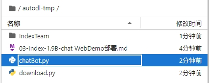
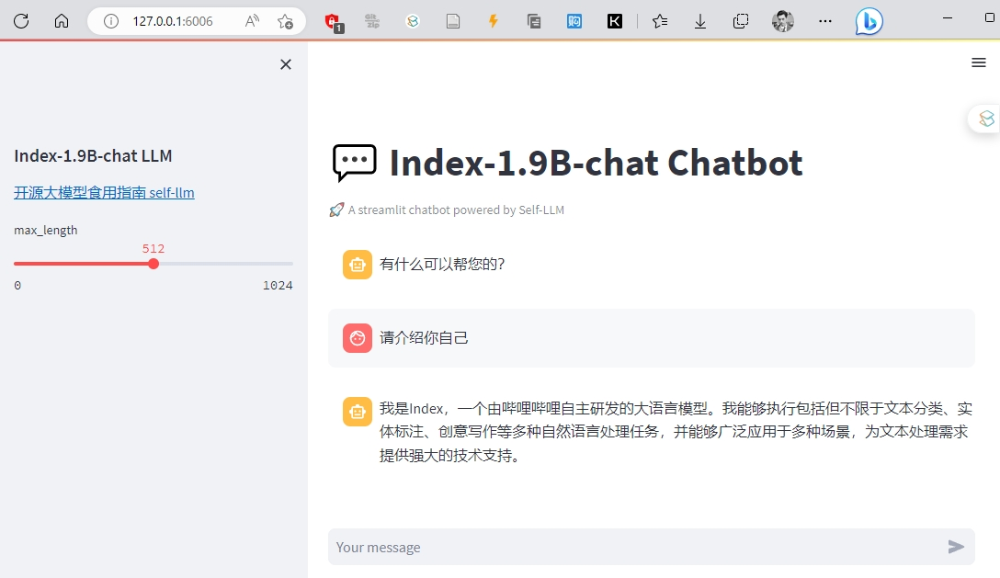

# Index-1.9B-chat WebDemo部署

## 环境准备

在 [AutoDL](https://www.autodl.com/) 平台中租一个 3090 等 24G 显存的显卡机器，如下图所示镜像选择 `PyTorch`-->`2.1.0`-->`3.10(ubuntu22.04)`-->`12.1`。


接下来打开刚刚租用服务器的 `JupyterLab`，并且打开其中的终端开始环境配置、模型下载和运行 `demo`。

pip 换源和安装依赖包。

```bash
# 升级pip
python -m pip install --upgrade pip
# 更换 pypi 源加速库的安装
pip config set global.index-url https://pypi.tuna.tsinghua.edu.cn/simple

pip install modelscope==1.9.5
pip install transformers==4.39.2
pip install streamlit==1.24.0
pip install sentencepiece==0.1.99
pip install accelerate==0.24.1
pip install transformers_stream_generator==0.0.4
pip install tiktoken==0.7.0
pip install huggingface_hub==0.23.4
```

## 模型下载

由于`modelscope`暂无更新Index-1.9B模型，使用 `huggingface_hub` 中的 `snapshot_download` 函数下载模型，第一个参数为模型名称，参数 `cache_dir` 为模型的下载路径。

由于huggingface下载较慢，我们可以使用镜像加快下载（ `os.environ['HF_ENDPOINT'] = "https://hf-mirror.com"` ）, 在 `/root/autodl-tmp` 路径下新建 `download.py` 文件并在其中输入以下内容，粘贴代码后记得保存文件。在终端输入并运行 `python /root/autodl-tmp/download.py` 执行下载，模型大小为 8 GB，下载模型大概需要 5~20 分钟。

可以使用autodl的学术资源加速（可参考[https://www.autodl.com/docs/network_turbo/](https://www.autodl.com/docs/network_turbo/)），在终端输入并运行`source /etc/network_turbo`后再输入 

```python
# 使用镜像加快下载
import os
os.environ['HF_ENDPOINT'] = "https://hf-mirror.com"

from huggingface_hub import snapshot_download

model_dir = snapshot_download('IndexTeam/Index-1.9B-Chat', local_dir='/root/autodl-tmp/IndexTeam/Index-1.9B-Chat', resume_download=True)
```


## 代码准备

在`/root/autodl-tmp`路径下新建 `chatBot.py` 文件并在其中输入以下内容，粘贴代码后记得保存文件。下面的代码有很详细的注释，大家如有不理解的地方，欢迎提出issue。




chatBot.py代码如下

```
# 导入所需的库
from transformers import AutoTokenizer, AutoModelForCausalLM, GenerationConfig
import torch
import streamlit as st

# 在侧边栏中创建一个标题和一个链接
with st.sidebar:
    st.markdown("## Index-1.9B-chat LLM")
    "[开源大模型食用指南 self-llm](https://github.com/datawhalechina/self-llm.git)"
    # 创建一个滑块，用于选择最大长度，范围在0到1024之间，默认值为512
    max_length = st.slider("max_length", 0, 1024, 512, step=1)

# 创建一个标题和一个副标题
st.title("💬 Index-1.9B-chat Chatbot")
st.caption("🚀 A streamlit chatbot powered by Self-LLM")

# 定义模型路径
model_name_or_path = '/root/autodl-tmp/Index-1.9B-Chat'

# 定义一个函数，用于获取模型和tokenizer
@st.cache_resource
def get_model():
    # 从预训练的模型中获取tokenizer
    tokenizer = AutoTokenizer.from_pretrained(model_name_or_path, use_fast=False, trust_remote_code=True)
    # 从预训练的模型中获取模型，并设置模型参数
    model = AutoModelForCausalLM.from_pretrained(model_name_or_path, torch_dtype=torch.bfloat16,  device_map="auto", trust_remote_code=True)
  
    return tokenizer, model

# 加载 Index-1.9B-chat 的model和tokenizer
tokenizer, model = get_model()

# 如果session_state中没有"messages"，则创建一个包含默认消息的列表
if "messages" not in st.session_state:
    st.session_state["messages"] = [{"role": "assistant", "content": "有什么可以帮您的？"}]

# 遍历session_state中的所有消息，并显示在聊天界面上
for msg in st.session_state.messages:
    st.chat_message(msg["role"]).write(msg["content"])

# 如果用户在聊天输入框中输入了内容，则执行以下操作
if prompt := st.chat_input():
    # 将用户的输入添加到session_state中的messages列表中
    st.session_state.messages.append({"role": "user", "content": prompt})
    # 在聊天界面上显示用户的输入
    st.chat_message("user").write(prompt)
    
    # 构建输入     
    input_ids = tokenizer.apply_chat_template(st.session_state.messages,tokenize=False,add_generation_prompt=True)
    model_inputs = tokenizer([input_ids], return_tensors="pt").to('cuda')
    generated_ids = model.generate(model_inputs.input_ids, max_new_tokens=512)
    generated_ids = [
        output_ids[len(input_ids):] for input_ids, output_ids in zip(model_inputs.input_ids, generated_ids)
    ]
    response = tokenizer.batch_decode(generated_ids, skip_special_tokens=True)[0]
    # 将模型的输出添加到session_state中的messages列表中
    st.session_state.messages.append({"role": "assistant", "content": response})
    # 在聊天界面上显示模型的输出
    st.chat_message("assistant").write(response)
    # print(st.session_state)
```

## 运行demo

在终端中运行以下命令，启动streamlit服务

```
streamlit run /root/autodl-tmp/chatBot.py --server.address 127.0.0.1 --server.port 6006
```

点击自定义服务


点开linux


然后win+R打开powershell


输入ssh与密码，按下回车至这样即可


在浏览器中打开链接 http://localhost:6006/ ，即可看到聊天界面。运行效果如下：

